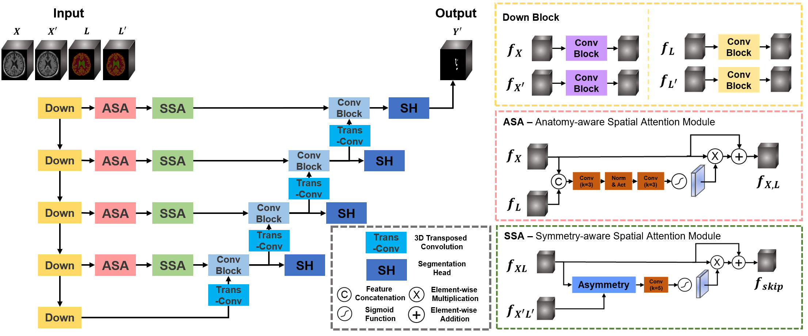

# ASAandSSA
This is the official implementation of our paper: **"Anatomy- and Symmetry-Aware Method for Stroke Lesion Segmentation"**.



## Installation Guide

### Prerequisites

- Docker

### Steps

1. **Clone the repository**
    ```sh
    git clone https://github.com/yourusername/ASAandSSA.git
    cd ASAandSSA
    ```

2. **Build the Docker image**
    ```sh
    bash bash_scripts/docker_build.sh
    ```

3. **Run the Docker container**
    ```sh
    bash bash_scripts/docker_run.sh
    ```

4. **Enter the Docker container**
    ```sh
    docker exec -it spark_nnunet /bin/bash
    . bash_script/nnUnetExport.sh
    ```

5. **Training and Inference**

    - **Preprocessing**
        ```sh
        nnUNetv2_plan_and_preprocess -d DATASET_ID --verify_dataset_integrity
        ```
        - **Configure the model**

            After preprocessing, you need to manually add the configuration of our model to your `nnUNetPlans.json` file in `nnUNet_preprocessed`. An example can be found under `config_ex/nnUNetPlans.json`.
    - **Training ASA and SSA model**
        ```sh
        bash run_train.sh
        ```

    - **Inference using ASA and SSA model**
        ```sh
        nnUNetv2_predict -i INPUT_FOLDER -o OUTPUT_FOLDER -d DATASET_ID -c 3d_bothATT -f all -p nnUNetPlans
        ```

### Troubleshooting

- If you encounter any issues, please check the [FAQ](#faq) or open an issue on GitHub.

### FAQ

- **How do I rebuild the Docker image?**
    ```sh
    bash bash_scripts/docker_build.sh --no-cache
    ```

- **How do I stop the Docker container?**
    ```sh
    Press `Ctrl+C` in the terminal where the container is running.
    ```
